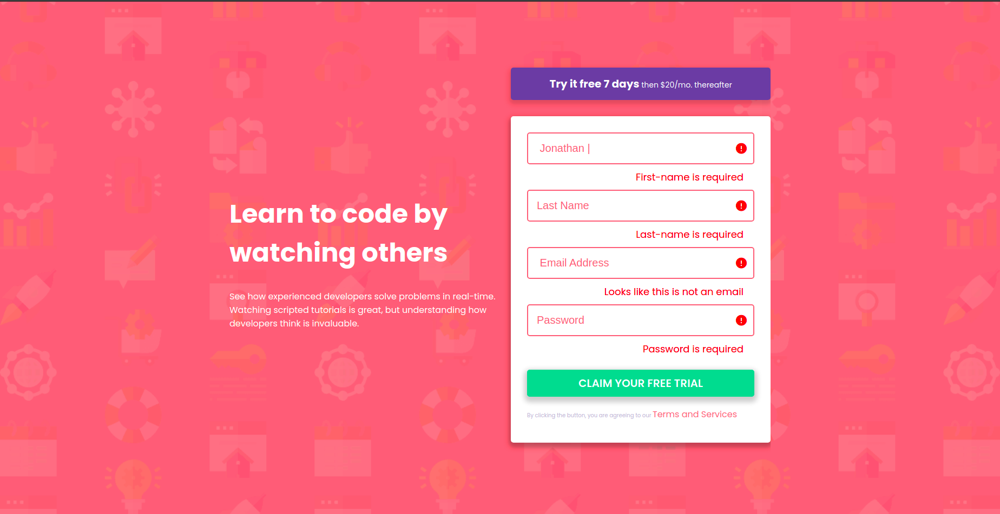

# Frontend Mentor - Intro component with sign up form solution

This is a solution to the [Intro component with sign up form challenge on Frontend Mentor](https://www.frontendmentor.io/challenges/intro-component-with-signup-form-5cf91bd49edda32581d28fd1)

## Table of contents

- [Overview](#overview)
  - [The challenge](#the-challenge)
  - [Screenshot](#screenshot)
  - [Links](#links)
  - [Built with](#built-with)
  - [Author](#author)
  - [Acknowledgments](#acknowledgments)
  -  [License](#license)

## Overview
Your challenge is to build out this introductory component and get it looking as close to the design as possible.

### The challenge
Your users should be able to:

- View the optimal layout for the site depending on their device's screen size
- See hover states for all interactive elements on the page
- Receive an error message when the `form` is submitted if:
  - Any `input` field is empty. The message for this error should say *"[Field Name] cannot be empty"*
  - The email address is not formatted correctly (i.e. a correct email address should have this structure: `name@host.tld`). The message for this error should say *"Looks like this is not an email"*

### Screenshot

;

;
### Links

- Solution URL: [Solution link](https://abdihakim20.github.io/Intro-component-with--ign-up/)
- Live Site URL: [Live site link](https://github.com/Abdihakim20/Intro-component-with--ign-up)

### Built with

- Semantic HTML5 markup
- CSS custom properties
- Flexbox

## Author

- Abdihakim
- h.abdihakim01@gmail.com
- 0792002156

## Acknowledgments

Thanks to myself for trying this one out.

## License

[MIT](https://choosealicense.com/licenses/mit/)